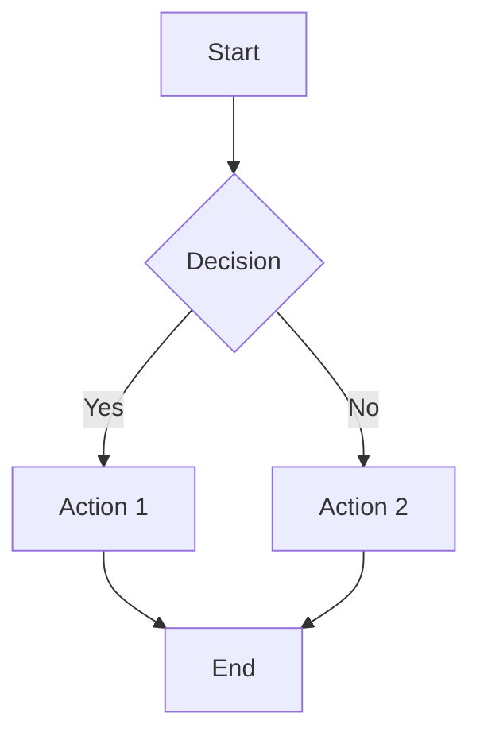
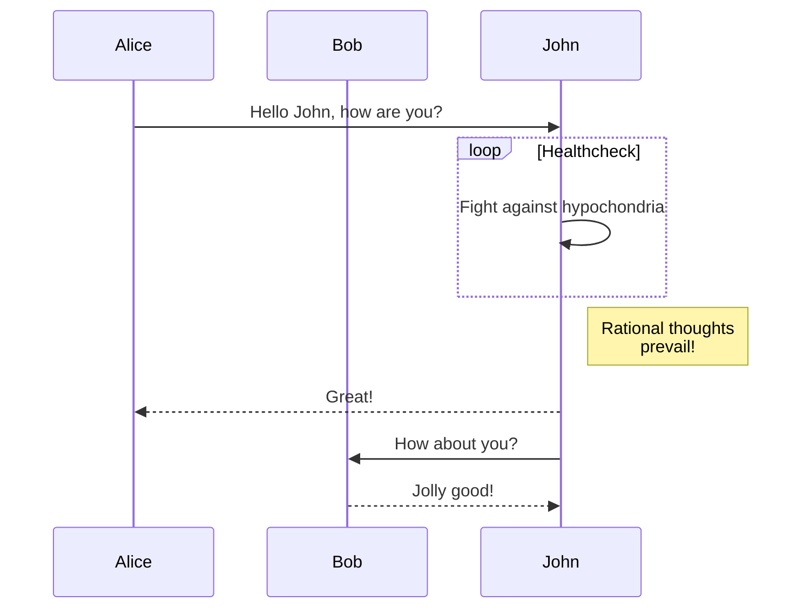

# Mermaid Diagrams Integration

This document outlines a comprehensive plan to integrate Mermaid diagram rendering into the static site generator at build time.

## Overview

The goal is to allow Mermaid diagrams to be written in Markdown files using fenced code blocks and automatically render them as SVG images during the build process. This approach provides:

- **Author convenience**: Write Mermaid syntax directly in Markdown
- **Performance**: Static SVG output with no client-side JavaScript dependency
- **Caching**: Integration with existing asset versioning system
- **Maintainability**: Follows existing patterns in the codebase

## Current Architecture Analysis

### Existing Goldmark Pipeline

The site uses goldmark with the following key components (from `cmd_generate.go`):

1. **Parser Configuration** (lines 206-219):
   ```go
   markdown := goldmark.New(
       goldmark.WithParserOptions(
           goldmarkparser.WithAutoHeadingID(),
           goldmarkparser.WithASTTransformers(
               goldmarkutil.Prioritized(newImageVersioningTransformer(generationDate), 100),
           ),
       ),
       goldmark.WithRendererOptions(
           goldmarkhtml.WithUnsafe(),
       ),
       goldmark.WithExtensions(
           goldmarkmeta.Meta,
       ),
   )
   ```

2. **Custom AST Transformer**: `imageVersioningTransformer` (lines 162-201)
   - Transforms image nodes to add cache-busting versioning
   - Uses `goldmarkast.Walk` to traverse the AST
   - Serves as a perfect template for Mermaid implementation

3. **Asset Versioning System**:
   - CSS/JS files get versioned with timestamps (line 694: `renameWithVersion`)
   - Images also get versioned via AST transformer
   - Generated Mermaid SVGs should follow the same pattern

## Proposed Solution

### 1. Mermaid AST Transformer

Create a new `mermaidTransformer` that:
- Detects code blocks with `mermaid` language
- Extracts Mermaid text content
- Generates SVG files using mermaid-cli
- Replaces code blocks with `` tags referencing generated SVGs

**Location**: `cmd_generate.go` (following `imageVersioningTransformer` pattern)

### 2. Build Process Integration

Extend the generation pipeline to:
- Process Mermaid diagrams during AST transformation phase
- Generate SVG files in a temporary directory
- Copy and version SVGs alongside other assets
- Clean up temporary files after build

### 3. Asset Handling

Update asset management to:
- Include `.svg` files in versioned extensions
- Handle Mermaid-generated SVGs with same cache-busting strategy
- Ensure proper directory structure for generated assets

## Implementation Plan

### Phase 1: Prerequisites

#### 1.1 Install mermaid-cli
```bash
npm install -g @mermaid-js/mermaid-cli
```

#### 1.2 Update Justfile
Add mermaid-cli check and installation:
```makefile
# Check for mermaid-cli
check-mermaid:
	@which mmdc >/dev/null || (echo "mermaid-cli required: npm install -g @mermaid-js/mermaid-cli" && exit 1)

# Add to existing build dependencies
build-dev: check-templ check-mermaid gen-template
build: check-templ check-mermaid gen-template
```

### Phase 2: Core Implementation

#### 2.1 Mermaid Transformer Structure

```go
type mermaidTransformer struct {
    generationDate time.Time
    tempDir        string
    logger         *slog.Logger
}

func newMermaidTransformer(generationDate time.Time, logger *slog.Logger) (*mermaidTransformer, error) {
    tempDir, err := os.MkdirTemp("", "mermaid-*")
    if err != nil {
        return nil, fmt.Errorf("unable to create temp dir for mermaid generation: %w", err)
    }

    return &mermaidTransformer{
        generationDate: generationDate,
        tempDir:        tempDir,
        logger:         logger,
    }, nil
}
```

#### 2.2 AST Transformation Logic

```go
func (t *mermaidTransformer) Transform(node *goldmarkast.Document, reader goldmarktext.Reader, pc goldmarkparser.Context) {
    if t.generationDate.IsZero() {
        return // Skip in dev mode if no versioning
    }

    var mermaidDiagrams []mermaidDiagram

    // First pass: collect all mermaid code blocks
    goldmarkast.Walk(node, func(n goldmarkast.Node, entering bool) (goldmarkast.WalkStatus, error) {
        if !entering {
            return goldmarkast.WalkContinue, nil
        }

        codeBlock, ok := n.(*goldmarkast.FencedCodeBlock)
        if !ok {
            return goldmarkast.WalkContinue, nil
        }

        // Check if language is "mermaid"
        language := string(codeBlock.Language(reader.Source()))
        if language != "mermaid" {
            return goldmarkast.WalkContinue, nil
        }

        // Extract Mermaid content
        lines := codeBlock.Lines()
        var mermaidText strings.Builder
        for i := 0; i < lines.Len(); i++ {
            line := lines.At(i)
            mermaidText.Write(reader.Source()[line.Start:line.Stop])
            if i < lines.Len()-1 {
                mermaidText.WriteString("\n")
            }
        }

        diagram := mermaidDiagram{
            node:        codeBlock,
            text:        mermaidText.String(),
            filename:    generateDiagramFilename(mermaidText.String()),
        }

        mermaidDiagrams = append(mermaidDiagrams, diagram)
        return goldmarkast.WalkContinue, nil
    })

    // Generate SVGs and replace nodes
    for _, diagram := range mermaidDiagrams {
        if err := t.generateAndReplace(diagram, reader, pc); err != nil {
            t.logger.Warn("failed to generate mermaid diagram",
                slog.String("filename", diagram.filename),
                slog.Any("error", err))
        }
    }
}
```

#### 2.3 SVG Generation Logic

```go
func (t *mermaidTransformer) generateAndReplace(diagram mermaidDiagram, reader goldmarktext.Reader, pc goldmarkparser.Context) error {
    // Write Mermaid text to temp file
    tempInput := filepath.Join(t.tempDir, diagram.filename+".mmd")
    tempOutput := filepath.Join(t.tempDir, diagram.filename+".svg")

    if err := os.WriteFile(tempInput, []byte(diagram.text), 0644); err != nil {
        return fmt.Errorf("unable to write mermaid input file: %w", err)
    }

    // Call mermaid-cli
    cmd := exec.Command("mmdc", "-i", tempInput, "-o", tempOutput, "-t", "default", "-w", "1200", "-H", "800")
    if output, err := cmd.CombinedOutput(); err != nil {
        return fmt.Errorf("mermaid-cli failed: %w, output: %s", err, string(output))
    }

    // Read generated SVG
    svgContent, err := os.ReadFile(tempOutput)
    if err != nil {
        return fmt.Errorf("unable to read generated SVG: %w", err)
    }

    // Create versioned filename
    versionedFilename := diagram.filename
    if !t.generationDate.IsZero() {
        versionedFilename, _ = renameWithVersion(diagram.filename+".svg", t.generationDate)
    }

    // Replace code block with image
    t.replaceNodeWithImage(diagram.node, versionedFilename, svgContent)

    return nil
}

func (t *mermaidTransformer) replaceNodeWithImage(node *goldmarkast.FencedCodeBlock, filename string, svgContent []byte) {
    parent := node.Parent()

    // Create new image node
    img := goldmarkast.NewImage()
    img.Destination = []byte("/" + filename)

    // Replace the code block with the image
    parent.ReplaceChild(parent, node, img)
}
```

### Phase 3: Integration

#### 3.1 Update Goldmark Configuration

```go
// In generatePages function
mermaidTransformer, err := newMermaidTransformer(generationDate, c.logger)
if err != nil {
    return fmt.Errorf("unable to create mermaid transformer: %w", err)
}
defer os.RemoveAll(mermaidTransformer.tempDir) // Cleanup

markdown := goldmark.New(
    goldmark.WithParserOptions(
        goldmarkparser.WithAutoHeadingID(),
        goldmarkparser.WithASTTransformers(
            goldmarkutil.Prioritized(newImageVersioningTransformer(generationDate), 100),
            goldmarkutil.Prioritized(mermaidTransformer, 200), // Higher priority
        ),
    ),
    // ... rest of configuration
)
```

#### 3.2 Asset Versioning Extension

Update `versionedExtensions` map to include SVGs:

```go
versionedExtensions := map[string]struct{}{
    ".css":  {},
    ".js":   {},
    ".avif": {},
    ".svg":  {}, // Add this for Mermaid diagrams
}
```

#### 3.3 File Copy Logic

Update `copyVersionedFiles` to handle generated Mermaid SVGs:

```go
// After processing pages, copy generated SVGs
if err := c.copyMermaidDiagrams(ctx, mermaidTransformer.tempDir, generationDate); err != nil {
    return err
}
```

## Data Structures

### Supporting Types

```go
type mermaidDiagram struct {
    node     *goldmarkast.FencedCodeBlock
    text     string
    filename string
}

func generateDiagramFilename(mermaidText string) string {
    // Create a stable filename based on content hash
    h := sha256.New()
    h.Write([]byte(mermaidText))
    return fmt.Sprintf("mermaid-%x", h.Sum(nil)[:8])
}
```

## Usage Examples

### Markdown Input

```markdown
# My Blog Post

Here's a flowchart:



And a sequence diagram:


```

### Generated Output

The build process will:
1. Generate two SVG files: `mermaid-a1b2c3d4.svg` and `mermaid-e5f6g7h8.svg`
2. Version them with timestamps: `mermaid-a1b2c3d4.12345678.svg`
3. Replace code blocks with: ``

## Error Handling

### Graceful Degradation

- If mermaid-cli fails, log warning and keep original code block
- If mermaid-cli not available, skip transformation entirely
- Invalid Mermaid syntax should not break the build

### Logging

Use structured logging for debugging:
```go
t.logger.Debug("processing mermaid diagram",
    slog.String("filename", diagram.filename),
    slog.Int("line_count", len(strings.Split(diagram.text, "\n"))),
)
```

## Performance Considerations

### Parallel Processing

Mermaid generation could be parallelized:
```go
func (t *mermaidTransformer) generateDiagramsParallel(diagrams []mermaidDiagram) error {
    var wg sync.WaitGroup
    errChan := make(chan error, len(diagrams))

    for _, diagram := range diagrams {
        wg.Add(1)
        go func(d mermaidDiagram) {
            defer wg.Done()
            if err := t.generateAndReplace(d, reader, pc); err != nil {
                errChan <- err
            }
        }(diagram)
    }

    wg.Wait()
    close(errChan)

    for err := range errChan {
        return err
    }

    return nil
}
```

### Caching Strategy

- Use content-based hashing for stable filenames
- Only regenerate diagrams when Mermaid content changes
- Consider caching generated SVGs across builds

## Testing Strategy

### Unit Tests

1. **Transformer Logic**: Test AST transformation with mock Mermaid blocks
2. **Filename Generation**: Verify stable, collision-free filenames
3. **SVG Generation**: Test mermaid-cli integration
4. **Error Handling**: Verify graceful failure modes

### Integration Tests

1. **End-to-End**: Full build process with Mermaid diagrams
2. **Asset Versioning**: Ensure SVGs are properly versioned
3. **Multiple Diagrams**: Test pages with multiple Mermaid blocks
4. **Blog Integration**: Verify TOC generation still works

### Test Files Structure

```
tests/
├── testdata/
│   ├── simple_mermaid.md
│   ├── multiple_diagrams.md
│   └── invalid_mermaid.md
└── mermaid_test.go
```

## Security Considerations

### Input Validation

- Sanitize Mermaid input to prevent command injection
- Limit diagram dimensions to prevent resource exhaustion
- Set timeouts for mermaid-cli execution

### File System Security

- Use temp directories with proper permissions
- Validate generated file paths
- Clean up temporary files reliably

## Future Enhancements

### Configuration Options

- Custom themes via frontmatter
- Configurable diagram dimensions
- Multiple output formats (PNG, PDF)
- Custom CSS classes for generated images

### Advanced Features

- Interactive diagrams with JavaScript fallback
- Diagram linking and references
- Custom Mermaid extensions
- Live preview in development mode

## Rollback Plan

If issues arise:
1. Remove mermaid transformer from AST transformers list
2. Comment out mermaid-cli dependency in Justfile
3. Existing Markdown files will display as regular code blocks
4. No impact on existing functionality

## Conclusion

This integration follows established patterns in the codebase while adding powerful diagram capabilities. The modular design ensures maintainability and provides a solid foundation for future enhancements.

The build-time approach provides optimal performance and caching while maintaining the author-friendly experience of writing diagrams directly in Markdown.