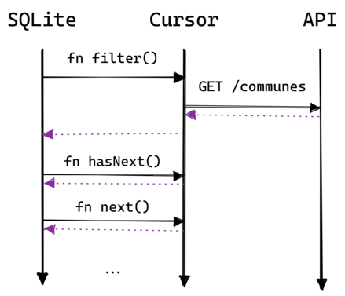
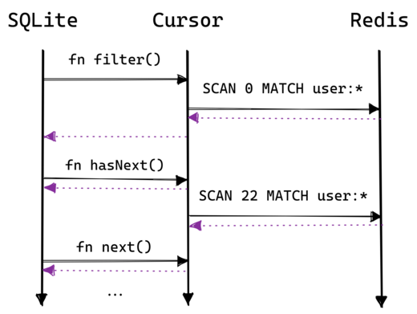
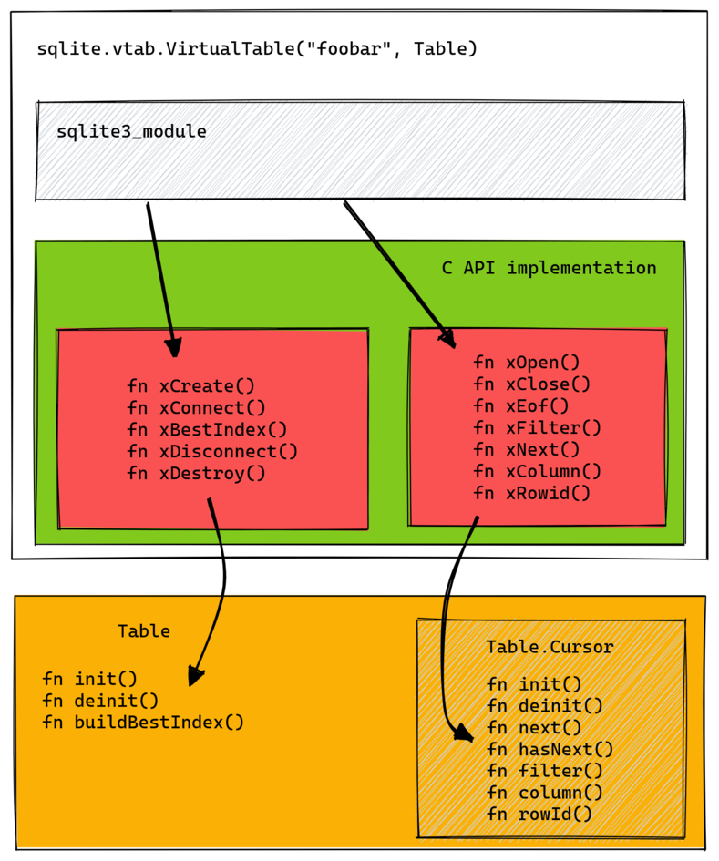
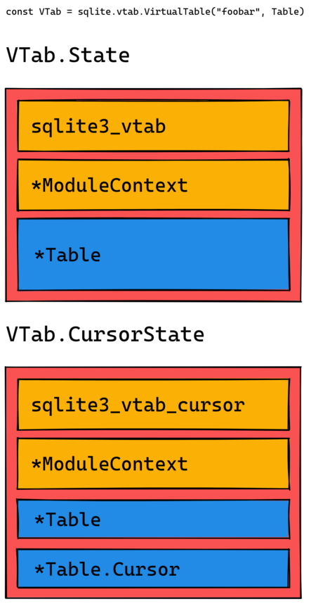
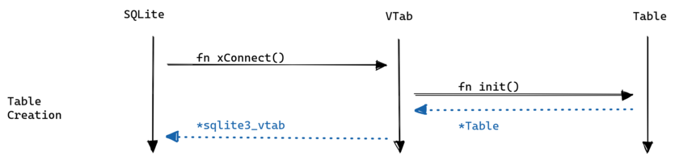
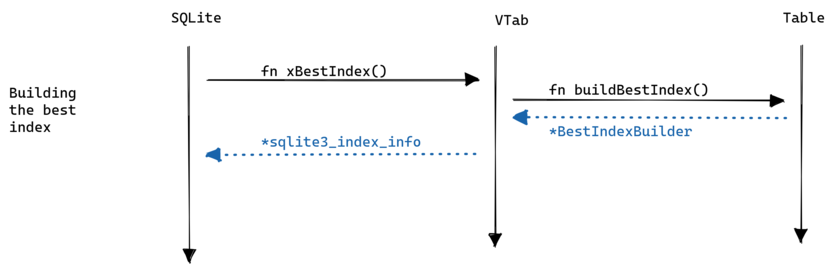
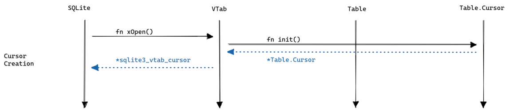
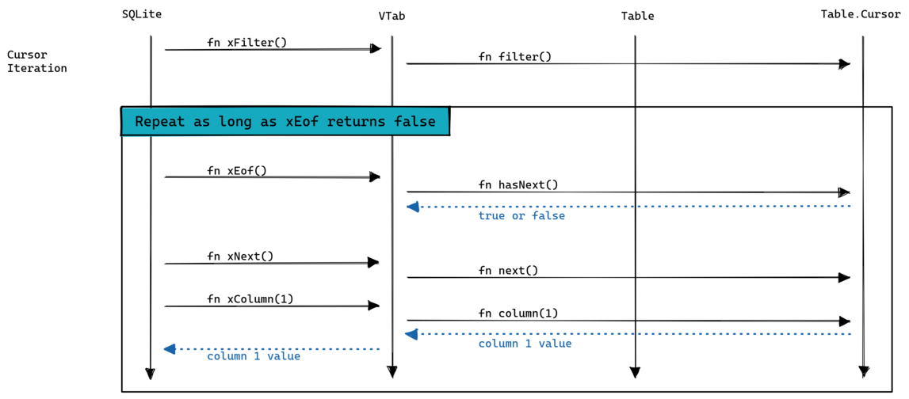
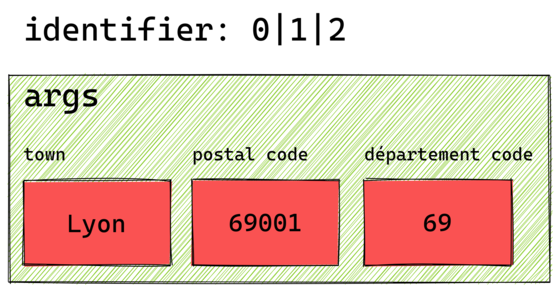

# Introduction

Over the last month I’ve been adding support for creating read-only virtual tables to [zig-sqlite](https://github.com/vrischmann/zig-sqlite), a Zig wrapper for SQLite.

[Virtual tables](https://sqlite.org/vtab.html) let you expose almost anything as a SQL table: this is powerful because you can then use all the power of SQLite and SQL to exploit it. Ever wanted to join a CSV, a JSON file and a REST API ? Virtual tables let you do that.

My goals for this feature were:

- providing a nice Zig API to implement a virtual table
- allow building a virtual table as a [loadable extension](https://sqlite.org/loadext.html)

Today I want to talk about how I implemented it and I’ll also talk about a small demo I made.

# Demo

While building the feature I started to build a demo app for testing and to showcase how to build a virtual table using zig-sqlite.

The demo is a little contrived but hopefully demonstrate the power of virtual tables. It contains two virtual tables:

- a table named `apida` that exposes a subset of the [*Découpage Administratif* API](https://geo.api.gouv.fr/decoupage-administratif) from the French government. With this API we can get all cities and towns in France with optional filters for the département or region.
- a table named `user` that exposes user data stored in Redis as hashes

## The “apida” virtual table

The idea for this table is to provide information about regions, départements, cities and towns by calling the [official French government API](https://geo.api.gouv.fr/decoupage-administratif).

The schema looks like this:

```sql
CREATE TABLE apida(
  town TEXT,
  postal_code INTEGER,
  departement_code INTEGER,
  region_code INTEGER,
  population INTEGER,
  longitude REAL,
  latitude REAL
)
```

This lets us do a lot of things, for example you might want to know all towns that share a postal code:

```sql
sqlite> SELECT group_concat(town, ',') FROM apida WHERE postal_code = 23320;
Bussière-Dunoise,Fleurat,Gartempe,Montaigut-le-Blanc,Saint-Silvain-Montaigut,Saint-Vaury
```

Or you want to list the 5 most populated towns with less than 1000 inhabitants in a particular département:

```sql
sqlite> SELECT town, population FROM apida WHERE departement_code = 23 AND population < 1000 ORDER BY population DESC LIMIT 5;
Chambon-sur-Voueize|868
Azerables|813
La Courtine|788
Saint-Priest-la-Feuille|777
Sardent|769
```

Thanks to virtual tables we get (almost) all the power of SQL to query the API and we didn’t actually have to write [that much code](https://github.com/vrischmann/zig-sqlite-vtab-demo/blob/55f9b5b4b8b56fc54222a218c15e62ec947e895a/src/vtab_apida.zig).

The implementation is simple: on each `SELECT` execution we fetch the town data from the API, store it locally in memory and then provide it to SQLite. The sequence diagram looks like this:



If there are `WHERE` clauses we can optimize this by fetching a more specific URL (for example we can filter based on the département code or the town name).

The mechanism to do this in virtual tables is to implement the [`Table.buildBestIndex`](https://github.com/vrischmann/zig-sqlite-vtab-demo/blob/master/src/vtab_apida.zig#L142) and [`Table.Cursor.filter`](https://github.com/vrischmann/zig-sqlite-vtab-demo/blob/master/src/vtab_apida.zig#L193-L232) methods in zig-sqlite. This is explained in more detail [here](https://www.notion.so/Virtual-tables-with-zig-sqlite-3da67d9f42224635a1fc05d9789b9f73).

This virtual table is also built as a [loadable extension](https://sqlite.org/loadext.html) (code [here](https://github.com/vrischmann/zig-sqlite-vtab-demo/blob/1d3939f82480787007b42d4ba7e946364938d7ac/src/vtab_apida_ext.zig)).

## The “user” virtual table

This table allows us to transparently query user data from a Redis instance. User data in Redis is stored as hashes: one field in the hash corresponds to a column in the virtual table.

The schema looks like this:

```sql
CREATE TABLE user(
  id TEXT,
  postal_code TEXT,
  name TEXT
)
```

This maps to the following in Redis:

```text
user:20
  postal_code = 75001
  name = vrischmann
```

In this table we don’t fetch everything at once, instead we take advantange of the [`SCAN`](https://redis.io/commands/scan/) command to iterate over the keyspace to find users. Then when SQLite asks the virtual table for a specific column we use [`HGET`](https://redis.io/commands/hget/) to get the field data. The sequence diagram looks like this:



Note that `hasNext` doesn’t always send a `SCAN` command: if the current Redis reply is not exhausted it simply uses it.

As the “apida” virtual table, this table is also built as a loadable extension (code [here](https://github.com/vrischmann/zig-sqlite-vtab-demo/blob/1d3939f82480787007b42d4ba7e946364938d7ac/src/vtab_user_ext.zig)).

## Using both virtual tables

Finally I made a simple tool that uses both virtual table (code [here](https://github.com/vrischmann/zig-sqlite-vtab-demo/blob/1d3939f82480787007b42d4ba7e946364938d7ac/src/main.zig)).

The code demonstrate how you can combine the two tables using SQL, the example fetches all users and for each user gets the towns associated with the user’s postal code:

```sql
SELECT u.rowid, u.id, u.name, u.postal_code, (
  SELECT group_concat(da.town) FROM decoupage_administratif da WHERE da.postal_code = u.postal_code
) AS town
FROM user u
```

Again, this is a contrived example. You could achieve the same result than this query in less code if that’s all you cared about. However, exposing the same data as a virtual table gives you flexibility and composability.

Alternatively you can load both virtual tables at runtime in the SQLite shell:

```text
sqlite> .load ./zig-out/lib/libapida.so
sqlite> .load ./zig-out/lib/libuser.so
```

Because both tables are [eponymous tables](https://www3.sqlite.org/vtab.html#eponymous_virtual_tables) you can immediately play around with both `apida` and `user` tables that are automatically available.

# Implementation

From the point of view of SQLite, a virtual table implementation is a [sqlite3_module](https://sqlite.org/c3ref/module.html) object filled with the methods of the virtual table.

Our [wrapper type](https://github.com/vrischmann/zig-sqlite/blob/master/vtab.zig#L563-L566) provides this module object and implement all these methods; the user will never have to work with this C API. Instead the user is expected to implement the [Table](https://github.com/vrischmann/zig-sqlite/blob/master/vtab.zig#L565) interface.

Since Zig doesn’t actually have traits or interfaces, we [validate at comptime](https://github.com/vrischmann/zig-sqlite/blob/master/vtab.zig#L298-L528) that the type provided has everything needed; if it doesn’t we return a compile error that is hopefully clear enough.

Here is a diagram showing how this all fits together:



The yellow part is what the user must implement.

## Keeping track of the user objects

One thing I didn’t mention above is how to find the correct `Table` and `Table.Cursor` objects when SQLite calls one of our callback.

If you’ve looked at the [signatures](https://sqlite.org/c3ref/module.html) in `sqlite3_module` they all work either with `sqlite3_vtab` or `sqlite_vtab_cursor` pointers. SQLite doesn’t know anything about our types, we need a bridge between the user objects and the SQLite objects.

The way this is done in C is to add a `sqlite3_vtab` or `sqlite3_vtab_cursor` field first in your own virtual table structure, you can then treat a pointer to your type as a `*sqlite3_vtab` or `*sqlite3_vtab_cursor`.

Here’s a trimmed down implementation of `xConnect` in C:

```c
struct myTable {
    sqlite3_vtab base;

    int myField;
};

static int myTableConnect(sqlite3 *db, void *pAux, int argc, const char *const*argv, sqlite3_vtab **ppVtab, char **pzErr) {
    struct myTable *pNew = sqlite3_malloc(sizeof(struct myTable));
    *ppVtab = (sqlite3_vtab*)pNew;
    return SQLITE_OK;
}

```

Then to get a pointer to your virtual table you simply cast the pointer:

```c
static int myTableDisconnect(sqlite3_vtab *pVtab){
  struct myTable *p = (struct myTable*)pVtab;
  sqlite3_free(p);
  return SQLITE_OK;
}
```

Luckily this pattern is easily supported by Zig thanks to the [`@fieldParentPtr`](https://ziglang.org/documentation/master/#toc-fieldParentPtr) function. Let’s look at the same `xConnect` and `xDisconnect` functions in Zig:

```zig
const myTable = struct {
    vtab: sqlite3_vtab,

    myField: usize,
};

var gpa = std.heap.GeneralPurposeAllocator(.{}){};

fn xConnect(db: ?*sqlite3, pAux: ?*anyopaque, argc: c_int, argv: [*c]const [*c]const u8, ppVtab: [*c][*c]sqlite3_vtab, pzErr: [*c][*c]const u8) callconv(.C) c_int {
    const allocator = gpa.allocator();
    const my_table = allocator.create(myTable);

    ppVtab.* = @ptrCast(*sqlite3_vtab, my_table);

    return 0;
}

fn xDisconnect(vtab: [*c]sqlite3_vtab) callconv(.C) c_int {
    const my_table = @fieldParentPtr(myTable, "vtab", vtab);

    const allocator = gpa.allocator();
    allocator.destroy(my_table);

    return 0;
}
```

While this works I didn’t want the user to have to add the `sqlite3_vtab` or `sqlite3_vtab_cursor` fields in their own types so I opted instead to use an internal type that wraps the user types; this has the added benefit that I can store additional data with the same lifetime as the table or cursor.

The following diagram shows the internal types and their fields:



Now it’s a matter of using `@fieldParentPtr` to get the `State` or `CursorState` object and have access to all their fields.

## Sequence of events

When you look at the [official documentation](https://sqlite.org/vtab.html) on virtual tables and the wrapper types in zig-sqlite, it’s not immediately clear how the initialization is done, in what order and when methods are called. I’ll try to explain this with sequence diagrams.

First let’s see how the table is initialized by SQLite:



This happens either when you create a table using `CREATE VIRTUAL TABLE USING` or if you simply execute a query on an eponymous virtual table.

Next, when you execute a `SELECT` statement SQLite calls the `xBestIndex` method to let the table build the *index information*. Let’s see how this works:



This *index information* will be passed to `xFilter` along with the arguments that `buildBestIndex` decided to keep.

Before filtering though SQLite has to initialize the cursor:



Then SQLite calls `xFilter` on the cursor followed by calls to `xEof`, `xNext` and `xColumn` to iterate over the cursor:



Finally when the cursor is exhausted SQLite calls `xClose`. The table is deinitialized when SQLite call `xDisconnect`.

## Building and using the “best index”

I mentioned above the `xBestIndex` method. Its purpose is to populate a [sqlite3_index_info](https://sqlite.org/c3ref/index_info.html) structure that will be used in two ways:

- SQLite itself uses it to decides what arguments (from the `WHERE` constraints) are passed to the `filter` method (the `aConstraintUsage` array in the documentation above).
- The `filter` method uses both the *index identifier* (`idxNum` or `idxStr` in the documentation above) and the filter arguments to setup the cursor appropriately.

This is how we decide the URL to fetch in the “apida” table:

- based on the constraints the [`buildBestIndex`](https://github.com/vrischmann/zig-sqlite-vtab-demo/blob/1d3939f82480787007b42d4ba7e946364938d7ac/src/vtab_apida.zig#L142-L162) method builds a specific index identifier
- next, [`filter`](https://github.com/vrischmann/zig-sqlite-vtab-demo/blob/1d3939f82480787007b42d4ba7e946364938d7ac/src/vtab_apida.zig#L201-L230) decodes the index identifier and uses that to build the URL we will fetch

Ultimately how you build your index identifier is up to you: SQLite doesn’t care about its value.

In “apida” we can only use constraints with the `=` operation because that’s what the upstream API supports, so the index identifier is just a list of column numbers, like this: `0|1|2`. The following diagram shows what the `filter` operation would get as input:



Then it’s a simple matter of decoding the identifier and using the most appropriate constraint to get the data.

## Returning the column values

Looking at the [`xColumn`](https://sqlite.org/vtab.html#the_xcolumn_method) method we can see that we’re supposed to provide our value using one of the various [`sqlite3_result_XYZ`](https://sqlite.org/c3ref/result_blob.html) function. Of course I don’t want to have the user of zig-sqlite to have to do this, it would be much better if our wrapper type takes care of calling the right result function and the user just returns a simple zig type.

We achieve this by using a *[tagged union](https://ziglang.org/documentation/master/#Tagged-union)* to represent the column. Our wrapper type doesn’t know about all different values of the tagged union so we have to do some compile-time reflection.

It works like this:

- iterate at compile-time over each field in the union and obtain its tag
- thanks to [type coercion](https://ziglang.org/documentation/master/#Type-Coercion-unions-and-enums) we obtain the tag of the runtime column value returned by the `column` method
- when both are equal we know which tag to use to obtain the *payload* from the union using `@field(tagged_union, tag_name)`
- finally we call `setResult` on it which *also* uses compile-time reflection to call the right result function.

Confused ? Ok, let’s look at an example:

```zig
const Column = union(enum) {
    name: []const u8,
    age: i32,
};

fn setResult(value: anytype) void {
    switch (@typeInfo(@TypeOf(value))) {
        .Pointer => std.debug.print("pointer: {s}\n", .{value}),
        .Int => std.debug.print("integer: {d}\n", .{value}),
        else => @compileError("foobar"),
    }
}

fn do(value: Column) void {
    const type_info = @typeInfo(@TypeOf(value)).Union;
    inline for (type_info.fields) |u_field| {
        if (type_info.tag_type) |UnionTagType| {
            const column_tag: std.meta.Tag(Column) = value;
            const this_tag: std.meta.Tag(Column) = @field(UnionTagType, u_field.name);

            if (column_tag == this_tag) {
                const column_value = @field(value, u_field.name);
                setResult(column_value);
            }
        } else @compileError("bad");
    }
}

pub fn main() !void {
    var column = Column{ .age = 20 };
    do(column);

    column = Column{ .name = "Vincent" };
    do(column);
}
```

This code lets us handle tagged unions in a generic way, without having to care about the different tag.

## Loadable extension

The last thing I want to talk about is the work that was necessary to be able to build a loadable extension, but first we need a little context.

A loadable extension is a shared library that can implement a virtual table, user defined functions, a VFS, etc. The [official documentation](https://sqlite.org/loadext.html#programming_loadable_extensions) on how to build a loadable extension in C is quite straightforward, however this won’t work with Zig for multiple reasons which I will describe below.

### `translate-c` shortcomings

The first problem is that we use `@cImport` to get access to the SQLite API; this in turn uses `zig translate-c`. For `sqlite3.h` this works fine but [`sqlite3ext.h`](https://github.com/sqlite/sqlite/blob/master/src/sqlite3ext.h) (which you’re supposed to use when building an extension) is problematic because it [aliases the SQLite API](https://github.com/sqlite/sqlite/blob/f333370e1ff64b27b8e578127414cce6fb37f7d6/src/sqlite3ext.h#L383-L684) with `#define`:

```c
#define sqlite3_bind_blob              sqlite3_api->bind_blob
#define sqlite3_bind_double            sqlite3_api->bind_double
...
```

When `translate-c` this file we get the following:

```zig
pub extern fn sqlite3_bind_blob(?*sqlite3_stmt, c_int, ?*const anyopaque, n: c_int, ?*const fn (?*anyopaque) callconv(.C) void) c_int;
pub extern fn sqlite3_bind_int(?*sqlite3_stmt, c_int, c_int) c_int;
```

This is just the original function definitions; `translate-c` doesn’t handle aliasing correctly.

By this point we know we will have to modify the header files somehow to make it work, let’s try to find what it will take. First, try to remove all original function definitions. The generated Zig code looks like this now:

```zig
pub const sqlite3_bind_blob = @compileError("unable to translate macro: undefined identifier `sqlite3_api`"); // c/sqlite3ext.h:388:9
pub const sqlite3_bind_int = @compileError("unable to translate macro: undefined identifier `sqlite3_api`"); // c/sqlite3ext.h:390:9
```

This code is broken but it makes sense: the `sqlite3_api` variable doesn’t exist anywhere. In C this variable is defined by the [`SQLITE_EXTENSION_INIT1`](https://github.com/sqlite/sqlite/blob/master/src/sqlite3ext.h#L689) macro however we can’t use this in Zig.

Ok, let’s try to modify the `sqlite3ext.h` and always add the `sqlite3_api` variable. The generated Zig code looks like this now:

```zig
pub const sqlite3_bind_blob = sqlite3_api.*.bind_blob;
pub const sqlite3_bind_int = sqlite3_api.*.bind_int;
```

This is close but won’t actually work because we’re referencing a runtime variable in a compime-only context.

Unfortunately I couldn’t find a way to have `translate-c` generate appropriate code for this.

### Re-exporting the SQLite API

The only working solution I could find is to reimplement the *complete* SQLite API in Zig by forwarding the calls to the `sqlite3_api` variable, basically something like this:

```zig
pub export fn sqlite3_bind_blob(pStmt: ?*c.sqlite3_stmt, i: c_int, zData: ?*const anyopaque, nData: c_int, xDel: ?fn (?*anyopaque) callconv(.C) void) c_int {
    return sqlite3_api.*.bind_blob.?(pStmt, i, zData, nData, xDel);
}
pub export fn sqlite3_bind_int(pStmt: ?*c.sqlite3_stmt, i: c_int, iValue: c_int) callconv(.C) c_int {
    return sqlite3_api.*.bind_int.?(pStmt, i, iValue);
}
```

This works fine, the only problem is that it is time consuming to write these functions because the SQLite API is quite large. Luckily this is a one time thing, later modifications of the SQLite API will require much less work.

### Complete solution

Let’s recap what we have to do:

- remove *all* function definitions in `sqlite3.h`
- remove *all* aliasing macros in `sqlite3ext.h`
- re-export the entire SQLite C API in Zig
- if building a loadable extension import our re-exported API, otherwise import the standard `sqlite3.h` header file.

The header processing is done with [a tool](https://github.com/vrischmann/zig-sqlite/blob/master/tools/preprocess_files.zig) I developed specifically for this task.

The re-exported API is in the [`c/loadable_extension.zig`](https://github.com/vrischmann/zig-sqlite/blob/c03103c712a5b459dcbe82bf265666b580bd32b9/c/loadable_extension.zig) file.

The last step is done in [`c.zig`](https://github.com/vrischmann/zig-sqlite/blob/c03103c712a5b459dcbe82bf265666b580bd32b9/c.zig#L3-L8): you control what you’re building by defining a `loadable_extension` constant at the root of your code, like this:

```zig
pub const loadable_extension = true;
```

If true we’re using our re-exported API, if not we’re using the standard API.

# Conclusion

This was a long post, hopefully you learned something !

The virtual table feature in zig-sqlite is not quite complete yet:

- there is no documentation
- we don’t differentiate between `xCreate` and `xConnect`.
- tables are read-only

I intend to work on the documentation in the near future; I’m not yet sure about the last two points. Patches welcome !
